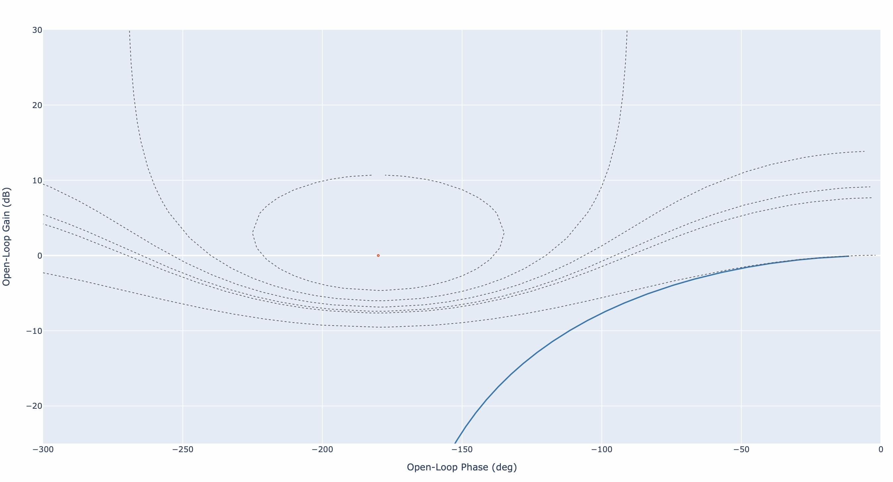
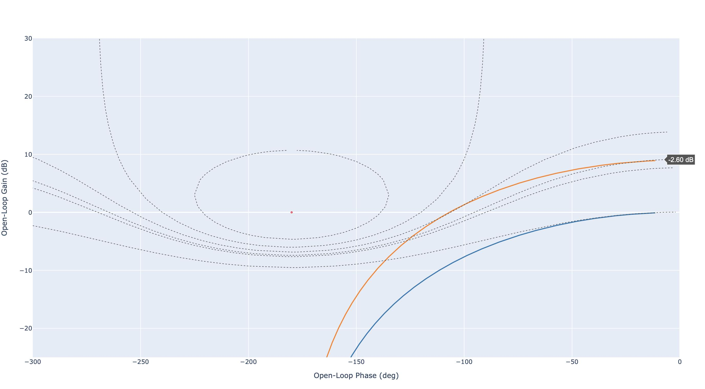
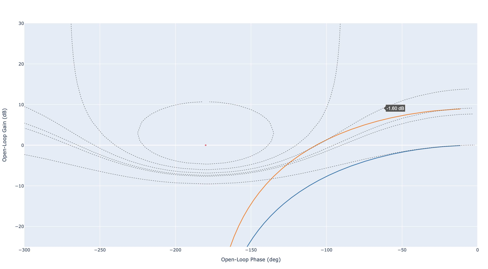
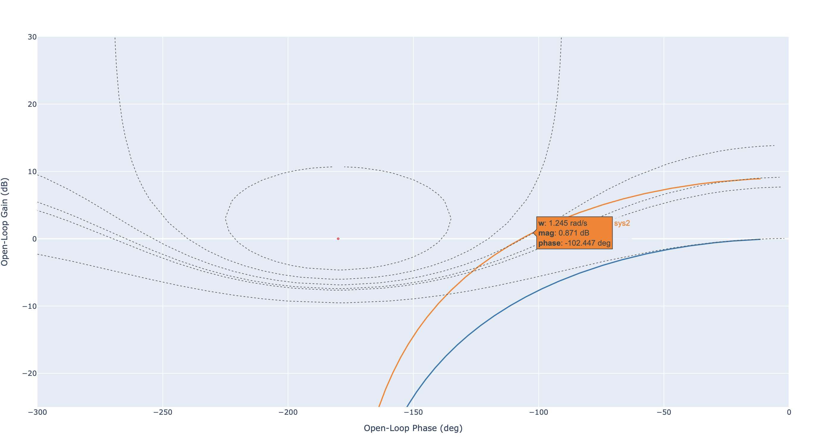
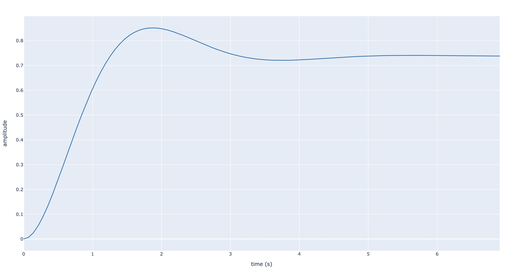

Correction P
============

Contexte
--------

Dans ce tutorial, nous nous intéressons à la correction d'un système de 2ieme ordre avec un retour unitaire.

.. figure:: img/closed_loop_2.svg
  :width: 350
  :align: center
  :alt: Boucle Fermée avec Retour unitaire

Dans ce tutorial, la fonction de transfert du système est égale à

.. math ::

    F(p)=\frac{1}{p^2+2p+1}

Notre objectif est d'obtenir en boucle fermée un coefficient d'amortissement de :math:`m=0.52`.

Calibration
-----------

Pour respecter ce cahier des charges, nous allons utiliser un correcteur proportionnel (P) :

.. math ::

    C(p) = K_i

Nous proposons de calibrer le paramètre du correcteur, :math:`K_i`, directement dans le plan de Black Nichols.

Black-Nichols
+++++++++++++

Dans un premier temps, nous allons représenter le comportement fréquentiel du système :math:`F(p)` en boucle ouverte.

.. code ::

    from control import tf, feedback
    from control_plotly import bode,nichols, step

    F = tf([1],[1, 2, 1])
    nichols(F, cm=[3, 0,-1.6, -2.6, -3, -6], show_phase=False)

  
  Diagramme de Black Nichols du système en boucle ouverte

Choix du gain
+++++++++++++

La seconde étape consiste à calibrer le gain proportionnel du correcteur. Pour calibrer ce gain, nous allons exploiter
le comportement à la résonance. En approximant le comportement du système en boucle fermée par un second ordre, le facteur de résonance :math:`M_{dB}`
s'obtient à partir du coefficient d'amortissement :math:`m` en utilisant les `abaque de second ordre <https://vincentchoqueuse.github.io/web_app_2nd_order_performances/index.html>`_. 

* D'après les abaques, :math:`m=0.52` correspond à un facteur de résonance de :math:`M_{dB}=G_m - G_0 = 1` dB.
* Après essais multiples, nous trouvons que le gain permettant d'obtenir la résonance souhaitée est égale à :math:`K_i=2.818`.

.. code ::

    Ki = 2.8
    nichols([F, Ki*F], cm=[3, 0,-1.6, -2.6, -3, -6],show_phase=False)

Les figures suivantes présentent le comportement fréquentiel du système original (bleu) et du système avec apport d'un gain :math:`K_i=2.818` (orange). L'apport d'un gain supérieur à 1 a pour effet de translater le lieu de transfert vers le haut.

  
  Diagramme de Black Nichols : correction proportionnelle (Gain statique :math:`G_0=-2.6` dB)

  
  Diagramme de Black Nichols : correction proportionnelle (Gain maximum :math:`G_m=-1.6` dB)

  
  Diagramme de Black Nichols : correction proportionnelle (pulsation de résonance :math:`\omega_r =1.245` rad/s)

Notons qu'il est possible d'anticiper le comportement de la boucle fermée.

* Gain statique: :math:`K=10^{G_0/20}=0.741`
* Premier dépassement relatif. En utilisant les abaques, nous trouvons :math:`14.77\%`
* Temps de réponse. Comme :math:`\omega_r = 1.245` rad/s et :math:`m = 0.52`, il en vient que :math:`\omega_n = 1.837` rad/s. En utilisant les abaques, nous trouvons que :math:`t_r\approx 2.8` s.

Vérification 
------------

La figure suivante présente la réponse indicielle du système en boucle fermée. Nous trouvons un premier dépassement relatif d'environ :math:`15\%`.
Concernant la précision, nous remarquons que la valeur finale est égale à :math:`s(\infty) =0.74` ce qui montre que le système est peu précis. Le temps de réponse mesuré est environ égal à :math:`t_r=2.72` s.

  
  Réponse indicielle du système corrigé en boucle fermée (échelon unité)