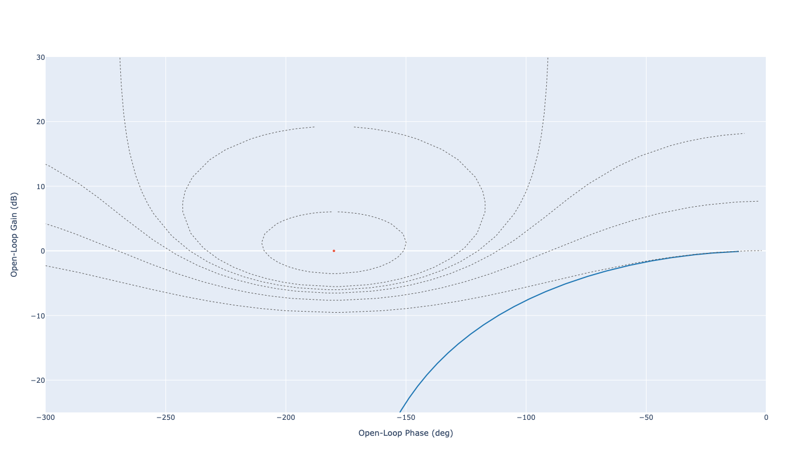
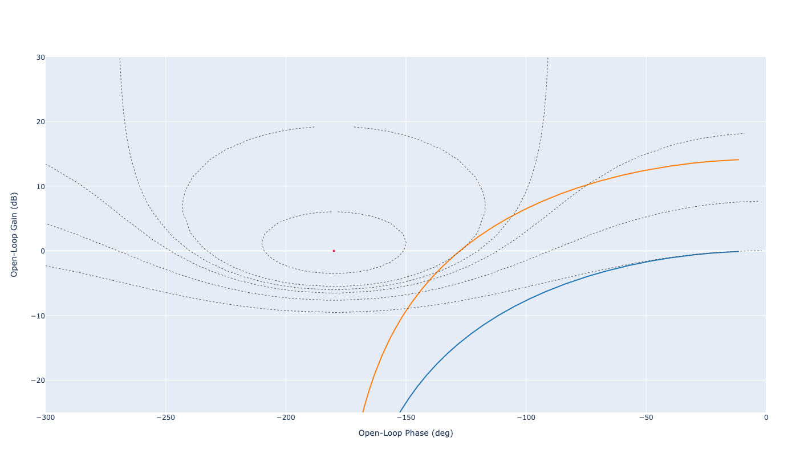
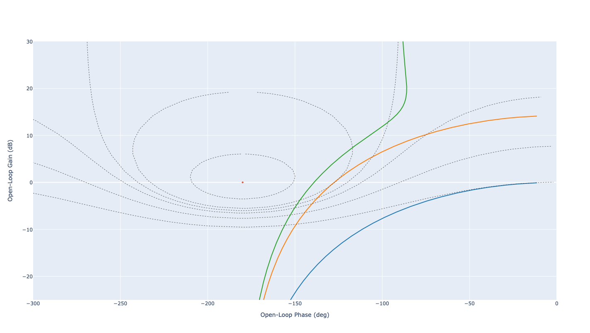
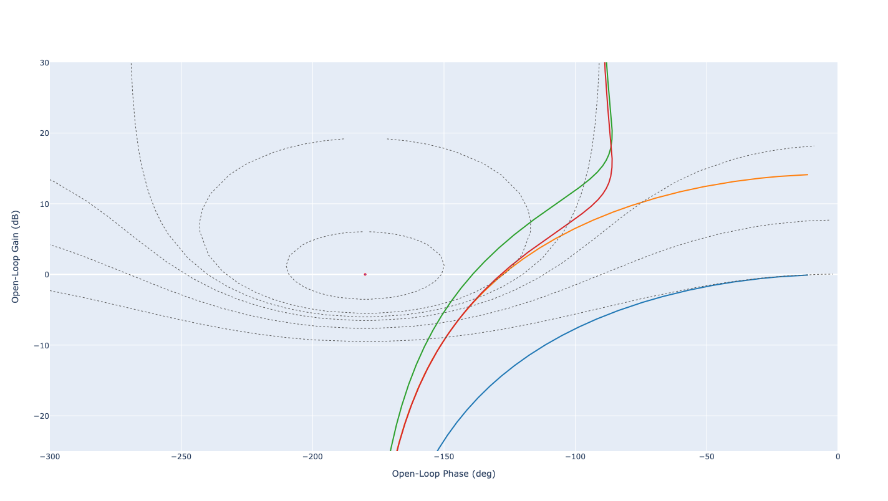
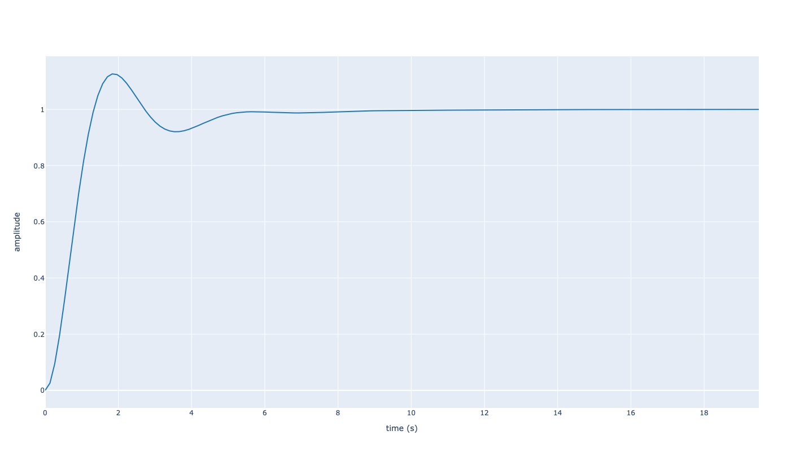

Correction PI
=============

Contexte
--------

Dans ce tutorial, nous nous intéressons à la correction d'un système de 2ieme ordre avec un retour unitaire.

.. figure:: img/closed_loop_2.svg
  :width: 350
  :align: center
  :alt: Boucle Fermée avec Retour unitaire

Dans ce tutorial, la fonction de transfert du système est égale à

.. math ::

    F(p)=\frac{1}{p^2+2p+1}

Notre objectif est d'obtenir en boucle fermée :

* un coefficient d'amortissement de :math:`m=0.52`,
* un gain statique unitaire. 

Calibration
-----------

Pour respecter ce cahier des charges, nous allons utiliser un correcteur proportionnel intégrale (PI) :

.. math ::

    C(p) = K_i \left(1+ \frac{1}{T_ip}\right) = K_i \frac{T_i p+1}{T_ip}

Dans ce tutorial, nous allons calibrer les paramètres du correcteur, c-à-d :math:`K_i` et :math:`T_i`, directement dans le plan 
de Black Nichols.

Black-Nichols
+++++++++++++

Dans un premier temps, nous allons représenter le comportement fréquentiel du système :math:`F(p)` en boucle ouverte.

.. code ::

    from control import tf, feedback
    from control_plotly import bode,nichols, step

    F = tf([1], [1, 2, 1])
    nichols(F, cm=[6, 1, 0, -1, -3, -6], show_phase=False, y_lim=[-25,30], x_lim=[-300,0])

  
  Diagramme de Black Nichols du système en boucle ouverte

Choix du gain (Partie 1)
++++++++++++++++++++++++

La seconde étape consiste à calibrer "grossièrement" le gain proportionnel du correcteur. Pour calibrer ce gain, nous allons exploiter
le comportement à la résonance. En approximant le comportement du système en boucle fermée par un second ordre, le facteur de résonance :math:`M_{dB}`
s'obtient à partir du coefficient d'amortissement :math:`m` en utilisant les abaques. Comme le correcteur PI permet d'obtenir un système précis en boucle fermée, le gain statique en BF est égal à 1 en valeur naturelle c-à-d :math:`G_0=0` dB. 
Il en vient que :math:`M_{dB}=G_m-G_0=G_m` dB. Nous allons donc 
appliquer un gain :math:`K_1` de sorte à venir tangenter **directement** le contour isogain :math:`G_m` dB.

* En utilisant les `Abaque de second ordre <https://vincentchoqueuse.github.io/web_app_2nd_order_performances/index.html>`_, nous trouvons pour :math:`m=0.52` un facteur de résonance de :math:`M_{dB}=1` dB.
* Le gain maximum en boucle fermée est égal à :math:`G_m=1` dB.
* Pour venir tangenter le contour iso-gain :math:`G_m=1` dB, nous devons appliquer un gain :math:`K_{1}(dB)=14.2` dB c-à-d :math:`K_1=10^{\frac{K_{1}(dB)}{20}}\approx 5.12` en valeur naturelle.

.. code ::

    K1dB = 14.2
    K1 = 10**(K1dB/20)
    nichols([F, K1*F], cm=[6, 1, 0, -1, -3, -6], show_phase=False)

La figure suivante présente le comportement fréquentiel du système original (bleu) et du système avec apport d'un gain :math:`K_1` (orange).

  
  Diagramme de Black Nichols : correction proportionnelle

Choix du paramètre Ti
+++++++++++++++++++++

La troisième étape consiste à régler le paramètre :math:`T_i`. L'action intégral du correcteur va entrainer un déphasage de -90 degrées en basse-fréquences (translation vers la gauche).
Il est alors important de bien calibrer le paramètre :math:`T_i` pour éviter que ce décalage n'impacte la marge de phase.

Pour ne pas modifier le point de résonance obtenu, on choisit la pulsation de cassure :math:`1/T_i` suffisamment éloignée de :math:`\omega_r` (pulsation de résonance au point de tangence) de telle manière à ne pas introduire un déphasage supplémentaire en ce point. 
Généralement, il faut fixer 

.. math :: 

    1/Ti \le \omega_r/5

* Graphiquement, nous trouvons une pulsation de résonance égale à :math:`\omega_r=2` rad/s.
* En prenant :math:`1/Ti=\omega_r/5` nous obtenons :math:`T_i=2.5` s.

.. code ::

    wr = 2
    Ti = 1/(wr/5)
    Cp = tf([K1*Ti, K1], [Ti,0])
    nichols([F, K1*F, Cp*F],cm=[6, 1, 0, -1, -3, -6], show_phase=False)

La figure suivante présente le comportement fréquentiel du système original (bleu), du système avec apport d'un gain :math:`K_1` (orange), et du système avec un correcteur PI 
de paramètres :math:`K_1` et :math:`T_i` (vert).

  
  Diagramme de Black Nichols : correction PI (gain :math:`K_1`)

Choix du gain (Partie 2)
++++++++++++++++++++++++

L'utilisation de l'intégration intégrale peut modifier légèrement le comportement à la résonance. La dernière étape consiste à ajuster 
le gain de manière à retrouver la résonance recherchée. 

* Graphiquement, nous observons que la courbe verte doit être baissée de :math:`K_2 (dB)=-4` dB pour retrouver la résonance recherchée.
* Le gain du correcteur doit alors être fixée à :math:`K_i =K_1\times K_2` avec :math:`K_2=10^{-4/20}=0.63`.

.. code ::

    K2dB = -4
    K2 = 10**(K2dB/20)
    Ki = K1*K2
    Cp2 = tf([Ki*Ti, Ki], [Ti, 0])
    nichols([F, K1*F, Cp*F, Cp2*F],cm=[6, 1, 0, -1, -3, -6], show_phase=False)

La figure suivante présente le comportement fréquentiel du système original (bleu), du système avec apport d'un gain :math:`K_1` (orange), du système avec un correcteur PI 
de paramètres :math:`K_1` et :math:`T_i` (vert), du système avec un correcteur PI 
de paramètres :math:`K_i` et :math:`T_i` (rouge).

  
  Diagramme de Black Nichols : correction PI (gain :math:`K_i`)

Vérification 
------------

La figure suivante présente la réponse indicielle du système en boucle fermée. Nous trouvons un premier dépassement relatif d'environ :math:`13\%` et donc un facteur d'amortissement égal à :math:`m=0.54`, ce qui est très proche du cahier des charges.
Concernant la précision, nous constatons bien l'influence du PI qui permet d'atteindre un gain statique unitaire en boucle fermée.

  
  Réponse indicielle du système corrigé en boucle fermée (échelon unité)